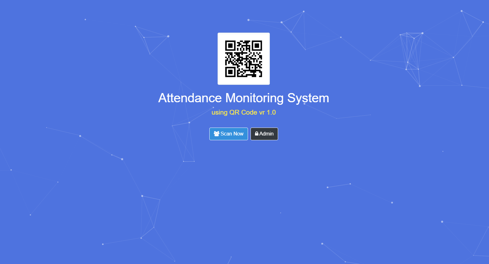

# Attendance Monitoring System using QRCode

This project was created on **October 2020** as a **school project**.  
It’s a simple attendance monitoring system built with Laravel and MySQL that uses QR codes for employee and intern time tracking.

---



## Tech Used

-   Laravel 5.0
-   MySQL
-   iziToast (for notifications)
-   Faker (for generating dummy data)

## Features

-   Create, update, and delete users
-   Upload user profile images
-   Generate downloadable QR Code files
-   Scan QR Codes for attendance logging
-   Error handling for invalid scans and missing users
-   Log active and inactive users
-   Track late arrivals and undertime records
-   Filter employee and intern records
-   Use Seeder to populate dummy data in MySQL

## Installation & Setup

### Prerequisites

1. Install XAMPP: [https://www.apachefriends.org/index.html](https://www.apachefriends.org/index.html)
2. Install Composer: [https://getcomposer.org/download/](https://getcomposer.org/download/)

### Steps to Run the Project

1. Clone the repository:

    ```bash
    git clone https://github.com/m-antoni/login.git
    cd login
    ```

2. Install dependencies:

    ```bash
    composer install
    ```

3. Copy `.env.example` to `.env` and configure your database connection (MySQL).

    ```bash
    cp .env.example .env
    ```

4. Generate the application key:

    ```bash
    php artisan key:generate
    ```

5. Run database migrations and seeders:

    ```bash
    php artisan migrate --seed
    ```

6. Start the Laravel development server:

    ```bash
    php artisan serve
    ```

7. Visit the app in your browser at:
    ```
    http://127.0.0.1:8000
    ```

---

### Additional Commands

To view all registered routes:

```bash
php artisan route:list
```

---

## Customizing the Seeder Files

You can modify the seeder files to generate custom dummy data or change default admin credentials.

### Register Seeder

File: `database/seeders/RegisterTableSeeder.php`

```php
<?php

namespace Database\Seeders;

use Illuminate\Database\Seeder;
use App\Register;

class RegisterTableSeeder extends Seeder
{
    public function run(): void
    {
        Register::factory()->count(100)->create();
    }
}
```

To customize:

-   Change the `count(100)` value to specify how many dummy users you want to generate.
-   Modify the fields in your `RegisterFactory` to customize the dummy data (names, emails, etc.).
-   After editing, run:

```bash
php artisan db:seed --class=RegisterTableSeeder
```

### Admin Seeder

File: `database/seeders/AdminTableSeeder.php`

```php
<?php

namespace Database\Seeders;

use Illuminate\Database\Seeder;
use App\Admin;

class AdminTableSeeder extends Seeder
{
    public function run(): void
    {
        Admin::factory()->create([
            'username' => 'admin',
            'password' => bcrypt('123456'),
        ]);
    }
}
```

To customize:

-   Change `'username'` or `'password'` fields as needed.
-   Example:

```php
'username' => 'superadmin',
'password' => bcrypt('mypassword123'),
```

After editing, run:

```bash
php artisan db:seed --class=AdminTableSeeder
```

---

## Folder Overview

-   `/app` — Application logic (models, controllers)
-   `/resources/views` — Blade templates (frontend UI)
-   `/public` — Public assets (images, scripts, styles)
-   `/database/seeders` — Seeder files used to populate data
-   `/routes/web.php` — Route definitions

---

## Notes

-   This project was an academic exercise, not intended for production use.
-   Built with Laravel 5.0, so some syntax or dependencies may need updates for modern versions.
-   Basic QR Code generation and scanning were used to simulate a real-world attendance system.

---

LinkedIn: [https://linkedin.com/in/m-antoni](https://linkedin.com/in/m-antoni)  
Email: michaelantoni.tech@gmail.com
